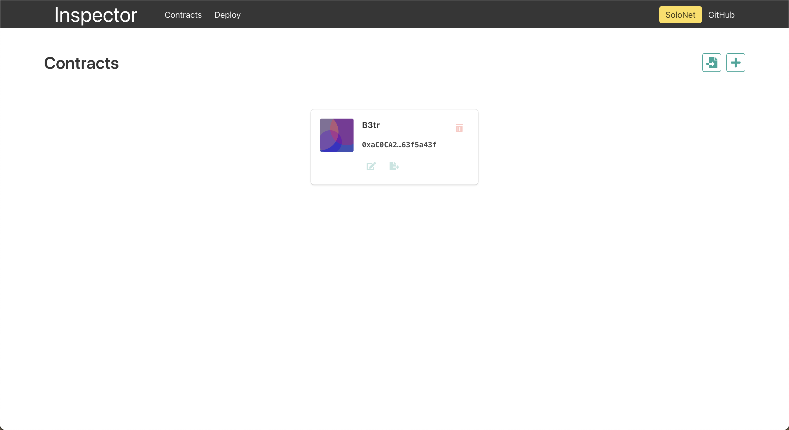

# Inspector


Static web site for contract call with ABI and contract address.

[Try it out!](https://inspector.vecha.in/#/)

## Screenshots



## Project setup

### Install dependencies

```
yarn
```

### Compiles with hot-reload for development

```
yarn serve
```

### Compiles and minifies for production

```
yarn build
```

## Build and run with Docker

```
docker build -t inspector-app .
```

```
docker run -dp 127.0.0.1:8080:80 inspector-app
```

or with docker compose

```
docker compose up -d --build
```

### In your local machine 

Create a `.env` file with the url of the solo node you want to connect

```
VUE_APP_SOLO_URL=http://localhost:8080
```

### With docker 

We can provide runtime env variables using -e 

#### Using image from registry 

```
docker run ghcr.io/vechain/insight-app:master -e VUE_APP_SOLO_URL=http://localhost:8080
```

#### Build local image 
```
docker build -t inspector-app 
docker run -e VUE_APP_SOLO_URL=http://localhost:8080
```

### With compose 

Use the image and pass the env variable in the compose file directly

```
version: "3.7"
services:
  insight:
    image: ghcr.io/vechain/inspector-app:master
    hostname: inspector
    container_name: inspector
    environment:
      - VUE_APP_SOLO_URL=http://localhost:8669
    ports:
      - "8080:80"
```


## Contributing

Everyone is always welcome to contribute on the codebase.
